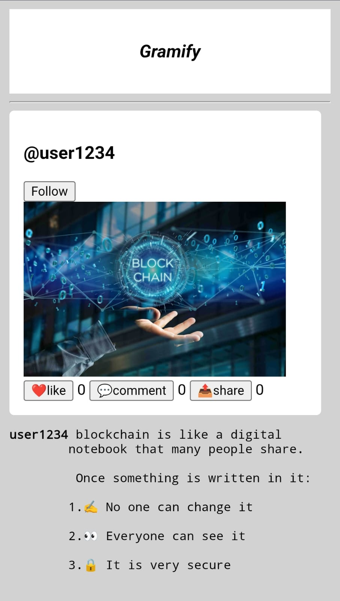

# Social Media Homepage

A simple social media homepage built using **HTML, CSS, and JavaScript**, inspired by the Instagram UI(~Gramify).

## 🔥 Features
- Responsive and clean user interface  
- Instant UI updates using JavaScript  
- Modular and well-structured code  
- Live deployment using Vercel  

## 🛠️ Tech Stack
- HTML5  
- CSS3  
- JavaScript (ES6)

## 📸 Screenshoot
- 

## 🚀 Live Demo
🔗 https://social-media-homepage-henna.vercel.app/

## 📂 Project Structure
- `index.html` – Main HTML file  
- `style.css` – Styling and layout  
- `logic.js` – UI interactions and logic  